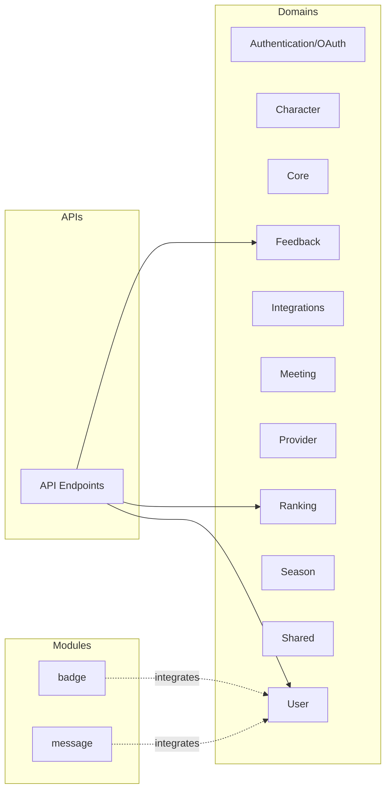

# System Architecture

> [!info] Macro View
> High-level view of the main domains and modules. Links lead to specific documents.

## Layers / Organization

- Domains in [[domains/core]] and other [[domains/*]] pages
- Modules in [[modules/badge]] and [[modules/message]]
- APIs documented in [[apis/endpoints]]

> [!note] Note
> Detailed relationships between components are reflected in the `metadata.json` graph and can be enriched as the documentation evolves.
