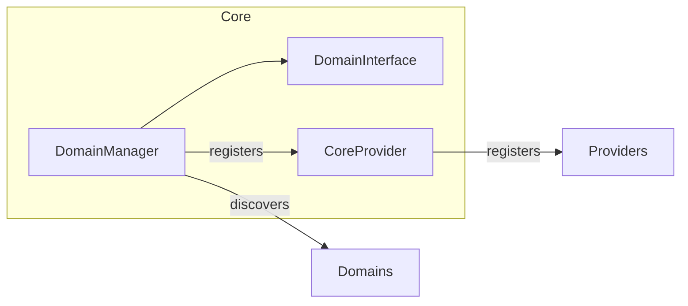

# Core

> [!info] Metadata
> Type: Domain
> Location: `Heart/Core`
> Status: Active

## Overview
Infrastructure nucleus: domain discovery/registration (DDD), provider lifecycle and shared utilities (Singleton, DTOs, contracts and exceptions).

## File Structure
```
Core/
├── Classes/
│   └── DomainManager.php
├── Contracts/
│   └── DomainInterface.php
├── DTO/
│   └── DomainDTO.php
├── Exceptions/
│   ├── DomainExtendException.php
│   └── DomainNotExistsException.php
├── Providers/
│   └── CoreProvider.php
└── Traits/
    └── Singleton.php
```

## Architectural Organization
- Classes
  - DomainManager: Discovers domains (folders with `*Domain.php`), normalizes names, validates inheritance of `DomainInterface` and registers providers of active domains.
- Contracts
  - DomainInterface: Abstract base for domains to declare providers and state (enabled/disabled).
- Providers
  - CoreProvider: Dynamically registers providers returned by all domains.
- Traits
  - Singleton: Standard singleton with init() for lazy initialization.

## Key Elements

### DomainManager
Type: Orchestration Class
Location: `Heart/Core/Classes/DomainManager.php`
Responsibility: Discover and load domains, validate contract, register providers.

### CoreProvider
Type: Service Provider
Location: `Heart/Core/Providers/CoreProvider.php`
Responsibility: Register all domain providers.

## Data Flows


## Implementation Notes
> [!note]
> - Domain discovery relies on files ending with `Domain.php`
> - Dedicated exceptions for missing path and invalid domain
> - Uses Singleton to ensure controlled initialization
