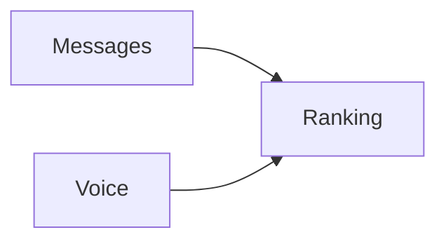

# Ranking

> [!info] Metadata
> Type: Domain
> Location: `Heart/Ranking`
> Status: Active

## Overview
Ranking by character experience.

## File Structure
```
Ranking/
├── Domain/
│   ├── Actions/
│   │   └── RankingByLevel.php
│   └── Repositories/
│       └── RankingRepository.php
└── Infrastructure/
  ├── Providers/
  │   ├── RankingRouteProvider.php
  │   └── RankingServiceProvider.php
  └── Repositories/
    └── RankingEloquentRepository.php
```

## Data Flows


## Tags
#domain #ranking
