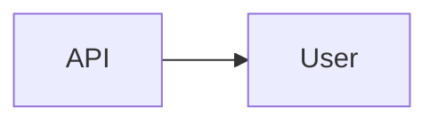

# User

> [!info] Metadata
> Type: Domain
> Location: `Heart/User`
> Status: Active

## Overview
User domain: use cases for listing, retrieving and updating profiles, with repositories and HTTP presentation layer.

## File Structure
```
User/
├── Application/
│   ├── FindProfile.php
│   ├── GetUser.php
│   ├── GetUsersPaginated.php
│   └── UpdateProfile.php
├── Domain/
│   ├── Actions/
│   │   └── GetProfile.php
│   ├── Entities/
│   │   ├── AddressEntity.php
│   │   ├── InformationEntity.php
│   │   ├── ProfileEntity.php
│   │   └── UserEntity.php
│   ├── Exceptions/
│   │   └── UserEntityException.php
│   ├── Repositories/
│   │   └── UserRepository.php
│   └── ValueObjects/
│       ├── UserId.php
│       └── UserName.php
├── Infrastructure/
│   ├── Factories/
│   │   ├── AddressFactory.php
│   │   ├── InformationFactory.php
│   │   └── UserFactory.php
│   ├── Models/
│   │   ├── Address.php
│   │   ├── Information.php
│   │   └── User.php
│   ├── Providers/
│   │   ├── UserRouteProvider.php
│   │   └── UserServiceProvider.php
│   └── Repositories/
│       └── UserEloquentRepository.php
└── Presentation/
  ├── Controllers/
  │   └── UsersController.php
  └── Requests/
    └── UpdateProfileRequest.php
```

## Architectural Organization
- Application: use cases (query, update)
- Domain: entities, VOs, repository and actions
- Infrastructure: models, factories, repositories and providers (routes/services)
- Presentation: controller and requests

## Data Flows


## Tags
#domain #user
