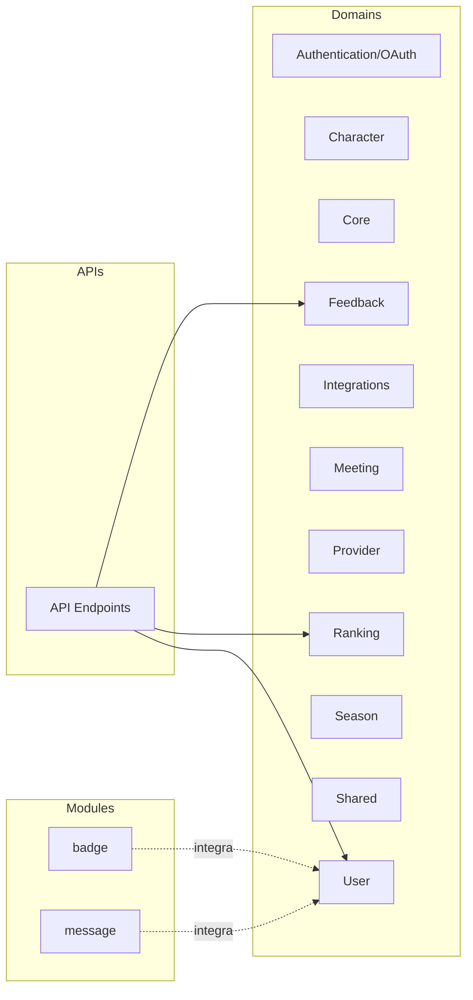

# Arquitetura Geral

> [!info] Visão Macro
> Esta visão fornece um panorama dos principais domínios e módulos do projeto. Links levam a documentos específicos.

## Camadas / Organização

- Domínios em [[domains/core]] e demais páginas de [[domains/*]]
- Módulos em [[modules/badge]] e [[modules/message]]
- APIs documentadas em [[apis/endpoints]]

> [!note] Observação
> Relacionamentos detalhados entre componentes são refletidos no grafo `metadata.json` e podem ser enriquecidos conforme a documentação evolui.
