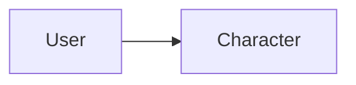

# Character

> [!info] Metadados
> **Tipo**: Domain
> **Localização**: `Heart/Character`
> **Status**: Active

## Visão Geral
[Descrição do domínio Character.]

## Estrutura de Arquivos
[Árvore do domínio.]

## Organização Arquitetural
[Camadas e serviços.]

## Principais Elementos

### [Elemento]
**Tipo**: [Class|Service|etc.]
**Localização**: `path/to/file`
**Responsabilidade**: [O que faz]

#### API Pública
```
signature(params): returnType
```

#### Dependências
- [[domains/user]] (se aplicável)

#### Usado Por
- [[modules/badge]] (se aplicável)

## Fluxos de Dados


## Integrações
- [Integrações]

## Testes
**Localização**: `path/to/tests`

## Notas de Implementação
> [!note]
> [Notas]

## Relacionamentos
**Depende de**: [[domains/user]]
**Usado por**: [[modules/badge]]

## Tags
#domain