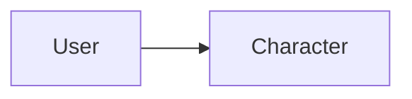

# Character

> [!info] Metadados
> **Tipo**: Domain
> **Localização**: `Heart/Character`
> **Status**: Active

## Visão Geral
[Descrição do domínio Character.]

## Estrutura de Arquivos
```
Character/
├── Application/
│   ├── ClaimCharacterBadge.php
│   ├── ClaimDailyBonus.php
│   ├── FindCharacterIdByUserId.php
│   └── (outros casos de uso)
├── Domain/
│   ├── Actions/
│   │   ├── FindCharacter.php
│   │   ├── GetCharacterByUserId.php
│   │   ├── IncrementExperience.php
│   │   ├── ManageReputation.php
│   │   ├── PaginateCharacters.php
│   │   ├── PersistClaimedBadge.php
│   │   └── PersistDailyBonus.php
│   ├── Collections/
│   │   └── PastSeasonCollection.php
│   ├── Entities/
│   │   ├── CharacterEntity.php
│   │   ├── DailyRewardEntity.php
│   │   ├── LevelEntity.php
│   │   ├── PastSeasonEntity.php
│   │   └── ReputationEntity.php
│   ├── Enums/
│   │   └── VoiceStatesEnum.php
│   ├── Exceptions/
│   │   ├── CharacterException.php
│   │   └── LevelException.php
│   └── Repositories/
│       └── CharacterRepository.php
├── Infrastructure/
│   ├── Factories/
│   │   ├── CharacterFactory.php
│   │   ├── PastSeasonFactory.php
│   │   └── WalletFactory.php
│   ├── Models/
│   │   ├── Character.php
│   │   ├── PastSeason.php
│   │   └── Wallet.php
│   ├── Providers/
│   │   ├── CharacterRouteProvider.php
│   │   └── CharacterServiceProvider.php
│   └── Repositories/
│       └── CharacterEloquentRepository.php
└── Presentation/
  ├── Controllers/
  │   └── CharactersController.php
  └── Requests/
    └── ClaimBadgeRequest.php
```

## Organização Arquitetural
- Application: casos de uso de progressão, badges e consulta
- Domain: entidades, coleções, enums, exceções, ações e contrato de repositório
- Infrastructure: models, factories, repositórios e providers
- Presentation: controller e requests

## Principais Elementos

### [Elemento]
**Tipo**: [Class|Service|etc.]
**Localização**: `path/to/file`
**Responsabilidade**: [O que faz]

#### API Pública
```
signature(params): returnType
```

#### Dependências
- [[domains/user]] (se aplicável)

#### Usado Por
- [[modules/badge]] (se aplicável)

## Fluxos de Dados


## Integrações
- [Integrações]

## Testes
**Localização**: `path/to/tests`

## Notas de Implementação
> [!note]
> [Notas]

## Relacionamentos
**Depende de**: [[domains/user]]
**Usado por**: [[modules/badge]]

## Tags
#domain