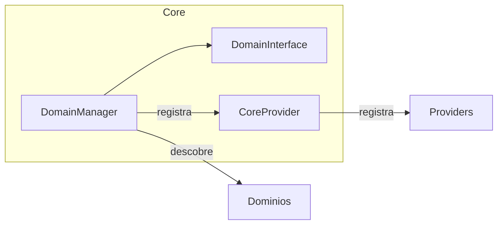

# Core

> [!info] Metadados
> **Tipo**: Domain
> **Localização**: `Heart/Core`
> **Status**: Active

## Visão Geral
Núcleo de infraestrutura do domínio: descoberta/registro de domínios (DDD), ciclo de vida de providers e utilitários compartilhados (Singleton, DTOs, contratos e exceções).

## Estrutura de Arquivos
```
Core/
├── Classes/
│   └── DomainManager.php
├── Contracts/
│   └── DomainInterface.php
├── DTO/
│   └── DomainDTO.php
├── Exceptions/
│   ├── DomainExtendException.php
│   └── DomainNotExistsException.php
├── Providers/
│   └── CoreProvider.php
└── Traits/
  └── Singleton.php
```

## Organização Arquitetural
- Classes
  - DomainManager: Descobre domínios (pastas com arquivo `*Domain.php`), normaliza nomes, valida herança de `DomainInterface` e registra providers dos domínios ativos.
- Contracts
  - DomainInterface: Base abstrata para domínios anunciarem providers e estado (habilitado/desabilitado).
- Providers
  - CoreProvider: Registra dinamicamente providers retornados por todos os domínios.
- Traits
  - Singleton: Padroniza singletons com init() para inicialização preguiçosa.

## Principais Elementos

### DomainManager
**Tipo**: Classe de orquestração
**Localização**: `Heart/Core/Classes/DomainManager.php`
**Responsabilidade**: Descobrir e carregar domínios, validar contrato, registrar providers.

### CoreProvider
**Tipo**: Service Provider
**Localização**: `Heart/Core/Providers/CoreProvider.php`
**Responsabilidade**: Registrar todos os providers de domínios carregados.

## Fluxos de Dados


## Notas de Implementação
> [!note]
> - Descoberta de domínios é baseada em convenção de arquivos terminando em `Domain.php`
> - Exceções dedicadas para caminho inexistente e domínio inválido
> - Usa Singleton para garantir inicialização controlada

## Tags
#domain