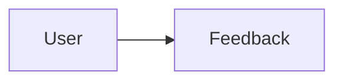

# Feedback

> [!info] Metadados
> **Tipo**: Domain
> **Localização**: `Heart/Feedback`
> **Status**: Active

## Visão Geral
[Descrição do domínio Feedback.]

## Estrutura de Arquivos
```
Feedback/
├── Application/
│   └── ReviewFeedback.php
├── Domain/
│   ├── Actions/
│   │   ├── CreateFeedback.php
│   │   ├── GetFeedbackById.php
│   │   └── PersistFeedbackReview.php
│   ├── DTOs/
│   │   ├── FeedbackReviewDTO.php
│   │   └── NewFeedbackDTO.php
│   ├── Entities/
│   │   └── FeedbackEntity.php
│   ├── Enums/
│   │   └── ReviewTypeEnum.php
│   └── Repositories/
│       └── FeedbackRepository.php
└── Infrastructure/
  ├── Exceptions/
  │   └── FeedbackException.php
  ├── Factories/
  │   └── FeedbackFactory.php
  ├── Models/
  │   ├── Feedback.php
  │   └── Review.php
  ├── Providers/
  │   ├── FeedbackRouteProvider.php
  │   └── FeedbackServiceProvider.php
  └── Repositories/
    └── FeedbackEloquentRepository.php
```

## Organização Arquitetural
- Application: caso de uso de revisão
- Domain: ações, DTOs, entidades, enum e contrato de repositório
- Infrastructure: exceções, factories, models, repositório e providers

## Principais Elementos

### [Elemento]
**Tipo**: [Class|Service]
**Localização**: `path/to/file`
**Responsabilidade**: [O que faz]

## Fluxos de Dados


## Tags
#domain #feedback