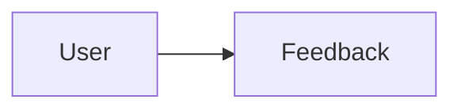

# Feedback

> [!info] Metadados
> **Tipo**: Domain
> **Localização**: `Heart/Feedback`
> **Status**: Active

## Visão Geral
[Descrição do domínio Feedback.]

## Estrutura de Arquivos
[Árvore.]

## Principais Elementos

### [Elemento]
**Tipo**: [Class|Service]
**Localização**: `path/to/file`
**Responsabilidade**: [O que faz]

## Fluxos de Dados

## Tags
#domain #feedback