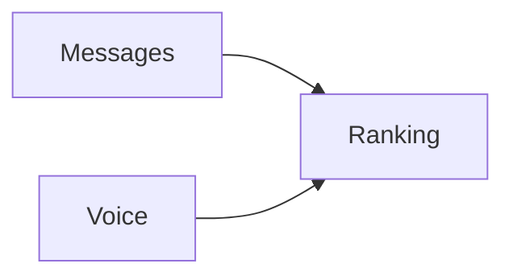

# Ranking

> [!info] Metadados
> **Tipo**: Domain
> **Localização**: `Heart/Ranking`
> **Status**: Active

## Visão Geral
[Descrição do domínio Ranking.]

## Estrutura de Arquivos
[Árvore.]

## Fluxos de Dados

## Tags
#domain #ranking