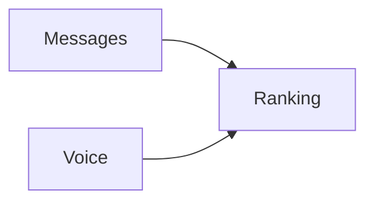

# Ranking

> [!info] Metadados
> **Tipo**: Domain
> **Localização**: `Heart/Ranking`
> **Status**: Active

## Visão Geral
[Descrição do domínio Ranking.]

## Estrutura de Arquivos
```
Ranking/
├── Domain/
│   ├── Actions/
│   │   └── RankingByLevel.php
│   └── Repositories/
│       └── RankingRepository.php
└── Infrastructure/
  ├── Providers/
  │   ├── RankingRouteProvider.php
  │   └── RankingServiceProvider.php
  └── Repositories/
    └── RankingEloquentRepository.php
```

## Organização Arquitetural
- Domain: ação de ranking e contrato de repositório
- Infrastructure: provider de rota/serviço e repositório persistente

## Fluxos de Dados


## Tags
#domain #ranking