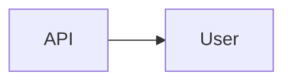

# User

> [!info] Metadados
> **Tipo**: Domain
> **Localização**: `Heart/User`
> **Status**: Active

## Visão Geral
[Descrição do domínio User.]

## Estrutura de Arquivos
```
User/
├── Application/
│   ├── FindProfile.php
│   ├── GetUser.php
│   ├── GetUsersPaginated.php
│   └── UpdateProfile.php
├── Domain/
│   ├── Actions/
│   │   └── GetProfile.php
│   ├── Entities/
│   │   ├── AddressEntity.php
│   │   ├── InformationEntity.php
│   │   ├── ProfileEntity.php
│   │   └── UserEntity.php
│   ├── Exceptions/
│   │   └── UserEntityException.php
│   ├── Repositories/
│   │   └── UserRepository.php
│   └── ValueObjects/
│       ├── UserId.php
│       └── UserName.php
├── Infrastructure/
│   ├── Factories/
│   │   ├── AddressFactory.php
│   │   ├── InformationFactory.php
│   │   └── UserFactory.php
│   ├── Models/
│   │   ├── Address.php
│   │   ├── Information.php
│   │   └── User.php
│   ├── Providers/
│   │   ├── UserRouteProvider.php
│   │   └── UserServiceProvider.php
│   └── Repositories/
│       └── UserEloquentRepository.php
└── Presentation/
  ├── Controllers/
  │   └── UsersController.php
  └── Requests/
    └── UpdateProfileRequest.php
```

## Organização Arquitetural
- Application: casos de uso (consulta, atualização)
- Domain: entidades, VOs, repositório e ações
- Infrastructure: models, factories, repositórios e providers (rotas e serviços)
- Presentation: controller e requests

## Principais Elementos

### [Elemento]
**Tipo**: [Class|Service]
**Localização**: `path`
**Responsabilidade**: [O que faz]

## Fluxos de Dados


## Tags
#domain #user