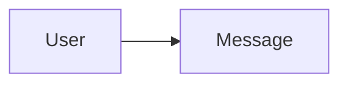

# Módulo: message

> [!info] Metadados
> **Tipo**: Module
> **Localização**: `app-modules/message`
> **Status**: Active

## Visão Geral
[Descrição do módulo de mensagens.]

## Estrutura de Arquivos
[Árvore do módulo.]

## Principais Elementos

### [Elemento]
**Tipo**: [Class|Service|Command|etc.]
**Localização**: `path/to/file`
**Responsabilidade**: [O que faz]

#### Dependências
- [[domains/user]] (se aplicável)

#### Usado Por
- [[apis/endpoints]]

## Fluxos de Dados

## Testes
**Localização**: `app-modules/message/tests`

## Notas de Implementação
> [!note]
> [Notas]

## Tags
#module #message